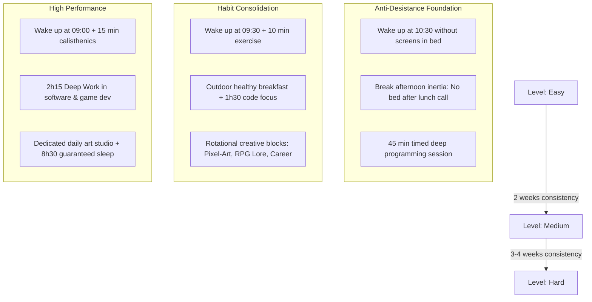

<div align="center">

# Flow

**Personal Routine & High-Performance Desktop App**

A minimalist personal productivity desktop application engineered to conquer daily routines through progressive levels (Easy, Medium, Hard), real-time habit tracking, and deep work focus.

[](https://nextjs.org/)
[](https://react.dev/)
[](https://v2.tauri.app/)
[](https://zustand.docs.pmnd.rs/)
[](https://www.typescriptlang.org/)

</div>

---

## Overview

**Flow** is designed around a core behavioral philosophy: *sustainable momentum through progressive habit adaptation*. Instead of jumping straight from inertia into an exhausting schedule, the app provides a progressive 3-tier routine system that ensures consistency before scaling effort.

> [!NOTE]
> Flow was built following high-end agency design principles, featuring nested *Double-Bezel (Doppelrand)* architecture, haptic physics transitions (`cubic-bezier(0.32, 0.72, 0, 1)`), synthesized Web Audio feedback, and Notion-inspired soft surfaces.

---

## Key Features

- **Progressive Routine Levels**: Seamlessly toggle between **Easy** (anti-desistance foundation), **Medium** (habit consolidation), and **Hard** (high performance) with preloaded schedule blocks.
- **Golden Rules Enforcement**: Special highlight and priority tracking for non-negotiable anchor habits (e.g. zero phone in bed upon waking, immediate inertia-breaking post-lunch).
- **Dual Timing Tracking**: Real-time comparison between estimated schedule windows and actual completion timestamps (`Done at 15:08`).
- **Interactive Daily Feedback**: Dynamic daily consistency scoring (Epic Day 100%, Good Progress, Recovery Mode) with haptic progress bar.
- **Category Matrix**: Quick filtering by functional domains (*Coding, Health & Sleep, Relationship, Routine, College, Creative/RPG, Leisure*).
- **Haptic Audio Synthesis**: Pure browser-native Web Audio API micro-sounds on task check and uncheck without external media asset dependencies.
- **Double-Bezel Aesthetics**: Machine-cut nested visual architecture with OLED Dark and Soft Cream/Ceramic themes.
- **Desktop Ready**: Configured for lightweight native distribution via Tauri v2.

---

## Routine Architecture



---

## Tech Stack

| Layer | Technology | Purpose |
|---|---|---|
| **Framework** | Next.js 15 (App Router) | Static export and optimized render pipeline |
| **UI Library** | React 19 + Vanilla CSS | Maximum stylistic control with custom design tokens |
| **Desktop Shell** | Tauri v2 | Cross-platform lightweight native packaging |
| **State Management** | Zustand (v5) + persist | Reactive state with atomic selectors and JSON persistence |
| **Icons & Micro-UI** | Lucide React | Precision line icons |
| **Typography** | Plus Jakarta Sans & Space Grotesk | Modern grotesque and clean sans-serif typography |
| **Audio Engine** | Web Audio API | Zero-latency synthesized haptic sound feedback |

---

## Getting Started

### Prerequisites

- [Node.js](https://nodejs.org/) (v18.0 or later, recommended v20+)
- npm (v9.0 or later)

### Installation

1. Clone the repository:
   ```bash
   git clone https://github.com/RainanKaneka/flow.git
   cd flow
   ```

2. Install dependencies:
   ```bash
   npm install
   ```

3. Launch the development server:
   ```bash
   npm run dev
   ```

4. Open your browser and navigate to:
   ```
   http://localhost:3000
   ```

### Building for Production

To create a static production build:

```bash
npm run build
```

The static bundle will be exported to the `out/` directory, ready for web hosting or Tauri bundling.

> [!TIP]
> If you have Rust and the Tauri CLI installed, you can build the native Windows desktop binary with `npm run tauri build`.
