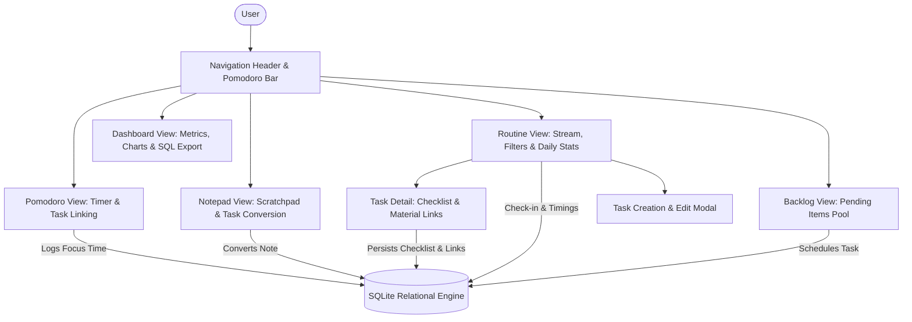

<div align="center">

# Flow

**Personal Routine, Habit Architecture & High-Performance Desktop App**

A minimalist personal productivity desktop application engineered to conquer daily routines through progressive levels, customizable routines, relational SQLite tracking, task checklists, integrated Pomodoro timer, and a creative scratchpad.

[](https://nextjs.org/)
[](https://react.dev/)
[](https://v2.tauri.app/)
[](https://sqlite.org/)
[](https://zustand.docs.pmnd.rs/)
[](https://www.typescriptlang.org/)

<br/>

[-6366F1?style=for-the-badge&logo=windows)](https://github.com/RainanKaneka/flow/releases/latest)

</div>

---

## Overview

**Flow** is designed around a core behavioral philosophy: *sustainable momentum through progressive habit adaptation*. Instead of jumping straight into an overwhelming schedule, Flow empowers users with customizable routine types (e.g. progressive levels, study tracks, work schedules), flexible category tagging, subtask checklists, and deep work focus.

> [!NOTE]
> Flow was built following high-end agency design principles, featuring nested *Double-Bezel (Doppelrand)* architecture, haptic physics transitions (`cubic-bezier(0.32, 0.72, 0, 1)`), Tibetan singing bowl sound synthesis via Web Audio API, and Notion-inspired soft ceramic surfaces.

---

## Key Features

### ⏱️ Pomodoro Timer & Deep Focus (RF-7 & RF-13)
- **Zero-Dependency Audio Synthesis**: Pleasant Tibetan singing bowl chime with multi-harmonic frequencies (528 Hz / 1056 Hz with 2.8s natural decay) upon session completion.
- **Task Linking**: Directly tie any active routine task to the Pomodoro timer.
- **Automated Time Accounting**: Completed focus sessions automatically log accumulated focus minutes directly into the task's historical tracking.
- **Flexible Modes & Controls**: Toggle between 25m Focus, 5m Short Break, and 15m Long Break with +/- 5m fine-tuning and global background execution.

### 📋 Task Specifications & Subtask Checklist (RF-6)
- **Deep Specifications Modal**: Click any task card to inspect rich guidance, step-by-step instructions, and target minutes.
- **Interactive Checklists**: Break down complex tasks into atomic subtasks with progress tracking.
- **Reference Materials & Links**: Attach external links (Notion, GitHub, docs, study videos) directly to the task.

### 📝 Freeform Notepad & Task Conversion (RF-8 & RF-14)
- **Notion-Inspired Board**: Fast, distraction-free scratchpad for brainstorming, project drafting, and daily journaling.
- **Color & Tag Classification**: Organize thoughts with custom color chips and tags.
- **One-Click Routine Conversion**: Convert any raw idea or drafted note directly into a scheduled routine task with customized start and end times.

### 🎯 Dynamic Routine Types & Custom Categories (Universal App)
- **Customizable Routine Types**: Create, rename, edit, or delete routine types (defaulting to Easy, Medium, Hard, or personal schedules).
- **Custom Categories**: Define custom category names, badge colors, and icons.
- **Golden Rules (Regras de Ouro)**: Non-negotiable daily anchor habits (e.g. out of bed without screens, focused study blocks).

### 📥 Pending Backlog Pool (RF-12)
- **Unscheduled Task Reservoir**: Store tasks that couldn't be completed on a given day or ideas that need future scheduling.
- **One-Click Pull to Today**: Drag or pull tasks from the backlog directly into the active daily schedule.

### 📊 Relational SQLite & Analytics Dashboard (RF-16)
- **Relational Integrity**: Complete SQLite 3 schema (`routine_types`, `categories`, `tasks`, `task_logs`, `notes`, `backlog_items`).
- **Performance Analytics**: Real-time streak tracking, weekly adherence score, total focus hours, and 7-day adherence charts.
- **One-Click SQL Backup Export**: Export full relational schema and data into standard `.sql` dump files anytime.

### 🔔 Desktop Experience, Reminders & Hotkeys (RF-12)
- **Windows System Reminders**: Background scheduler (`reminderScheduler.ts`) checks upcoming daily routine blocks and fires native alerts.
- **Customizable Advance Notice**: Configure warnings for exact time (0 min), 5 min before, 10 min before, or 15 min before.
- **Synthesized Glass Chime**: Pleasant two-tone harmonic notification audio via Web Audio API.
- **High-Performance Global Hotkeys**:
  - `1` - `5`: Instant navigation between Routine, Pomodoro, Notes, Backlog, and Dashboard.
  - `Space`: Quick toggle start / pause on Pomodoro timer.
  - `Ctrl + N`: Open New Task creation modal from anywhere in the app.
  - `Esc`: Close any active modal.

---

## Application Architecture



---

## Tech Stack

| Layer | Technology | Purpose |
|---|---|---|
| **Framework** | Next.js 15 (App Router) | Static export and high-performance render pipeline |
| **UI Library** | React 19 + Vanilla CSS | Strict Double-Bezel architecture and custom design tokens |
| **Desktop Shell** | Tauri v2 | Lightweight native packaging (<15MB executable) |
| **Database Engine** | SQLite 3 (`sql.js` / WebAssembly) | Zero-overhead relational persistence with `.sql` exports |
| **State Management** | Zustand (v5) + persist | Reactive atomic store with localStorage & SQLite sync |
| **Icons** | Lucide React | Precision geometric icons |
| **Typography** | Plus Jakarta Sans & Space Grotesk | Modern grotesque and clean monospace typography |
| **Audio Engine** | Web Audio API | Zero-latency synthesized haptic sounds & singing bowl chime |

---

## Getting Started

### Prerequisites

- [Node.js](https://nodejs.org/) (v18.0 or later, recommended v20+)
- npm (v9.0 or later)

### Installation & Run

1. Clone the repository:
   ```bash
   git clone https://github.com/RainanKaneka/flow.git
   cd flow
   ```

2. Install dependencies:
   ```bash
   npm install
   ```

3. Launch development server:
   ```bash
   npm run dev
   ```

4. Access the application in your browser:
   ```
   http://localhost:3000
   ```

### Building for Production

To create a static production build:

```bash
npm run build
```

The optimized static bundle will be exported to the `out/` directory, ready for Tauri desktop bundling or web distribution.

> [!TIP]
> To bundle the native desktop app with Tauri v2, run `npm run tauri build`.
